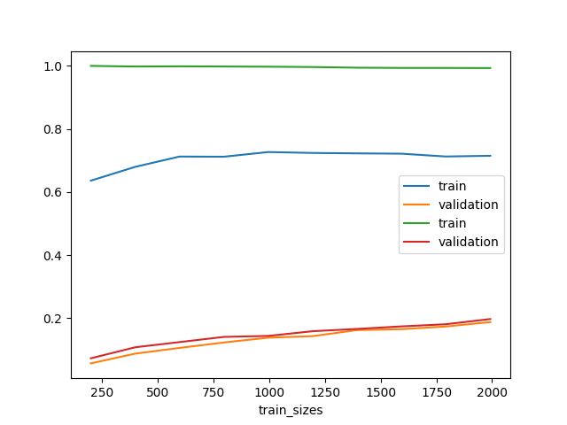

# Analyse des tests avec SVM

 Afin de trouver le modèle le plus performant dans notre cas on va appliquer plusieur modèle sur nos jeu de donnée

 ## Application simple d'un SVM

 Dans un premier temps, nous allons appliquer un SVM avec les paramètres pas defaut 

 ## Explication des performances 
 Quand on regarde la courbe d'apprentissage de nos deux modèles de SVM, on voit se répéter le phénomène suivant :

 

 En commencant par le SVM 