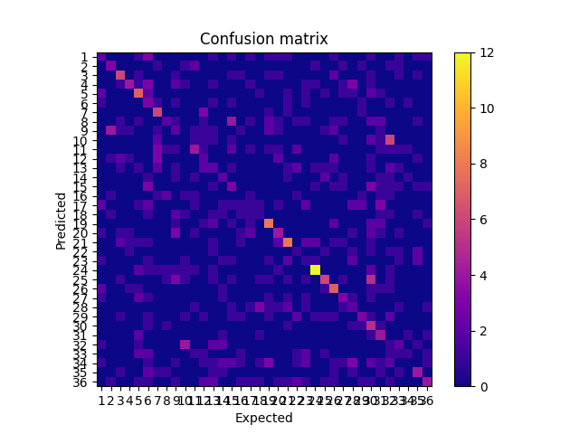
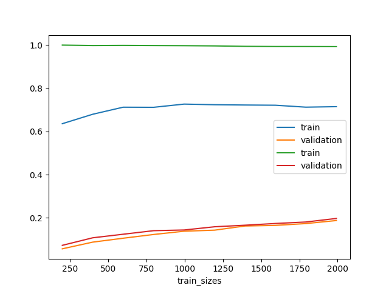

# Analyse des tests avec SVM

 Afin de trouver le modèle le plus performant dans notre cas on va appliquer plusieur modèle sur nos jeu de donnée

## Donnée d'entré et problématique

(présenter les données )

 ## Application simple d'un SVM

 Dans un premier temps, nous allons appliquer un SVM avec les paramètres par défaut, l'idée de ce premier et de voir si un SVM peut-être adapté à nos données et au problème qui l'on veut résoudre. 

 Puis une fois tester sans paramètrer (finetuning) le modèle, on va le passer dans GridSearch (élaborer la crossvalidation) afin de tirer un modèle avec des paramètres qui s'adaptent le mieux à nos données. 

(mieux différencier les deux modèles)

 Ainsi avec ces deux modèles on pourra juger si un SVM est adapté à notre cas ou si notre jeu de données peut convenir à notre problèmatique.

 ## Explication des performances 
 Regardons la matrice de confusion du modèle standard sur notre jeu de donnée : 

### Rapport sur 128x128
              precision    recall  f1-score   support

           1       0.09      0.10      0.10        10
           2       0.26      0.42      0.32        12
           3       0.15      0.25      0.19        16
           4       0.14      0.30      0.19        10
           5       0.24      0.35      0.29        17
           6       0.12      0.15      0.14        20
           7       0.20      0.45      0.28        11
           8       0.16      0.18      0.17        17
           9       0.00      0.00      0.00        18
          10       0.25      0.18      0.21        22
          11       0.20      0.31      0.24        16
          12       0.27      0.20      0.23        15
          13       0.18      0.09      0.12        23
          14       0.08      0.06      0.07        17
          15       0.21      0.22      0.21        23
          16       0.06      0.08      0.07        12
          17       0.06      0.07      0.06        15
          18       0.30      0.33      0.32        18
          19       0.27      0.32      0.29        25
          20       0.13      0.10      0.11        21
          21       0.45      0.45      0.45        22
          22       0.11      0.08      0.09        13
          23       0.33      0.28      0.30        18
          24       0.18      0.17      0.17        12
          25       0.21      0.24      0.22        17
          26       0.60      0.43      0.50        21
          27       0.18      0.11      0.13        19
          28       0.36      0.22      0.28        18
          29       0.10      0.04      0.06        24
          30       0.20      0.41      0.26        22
          31       0.33      0.20      0.25        20
          32       0.29      0.18      0.22        22
          33       0.12      0.11      0.12         9
          34       0.09      0.06      0.07        17
          35       0.22      0.22      0.22        18
          36       0.14      0.15      0.15        13

    accuracy                           0.21       623
   macro avg       0.20      0.21      0.20       623
weighted avg       0.21      0.21      0.20       623

### Rapport sur 32x32 
              precision    recall  f1-score   support

           1       0.00      0.00      0.00        12
           2       0.38      0.27      0.32        11
           3       1.00      0.05      0.10        19
           4       0.00      0.00      0.00        15
           5       0.03      0.13      0.05        15
           6       0.17      0.06      0.08        18
           7       0.33      0.23      0.27        13
           8       0.00      0.00      0.00        14
           9       0.00      0.00      0.00        19
          10       0.33      0.05      0.09        19
          11       0.40      0.08      0.13        25
          12       0.00      0.00      0.00        15
          13       1.00      0.04      0.08        25
          14       0.00      0.00      0.00        14
          15       0.12      0.05      0.07        22
          16       0.00      0.00      0.00        15
          17       0.00      0.00      0.00        27
          18       0.00      0.00      0.00        11
          19       0.00      0.00      0.00        12
          20       0.00      0.00      0.00        18
          21       0.33      0.03      0.06        29
          22       0.00      0.00      0.00         9
          23       0.00      0.00      0.00        12
          24       0.64      0.27      0.38        26
          25       0.00      0.00      0.00        21
          26       0.25      0.21      0.23        24
          27       0.00      0.00      0.00        16
          28       0.00      0.00      0.00        13
          29       0.00      0.00      0.00        11
          30       0.00      0.00      0.00        18
          31       0.02      0.46      0.04        13
          32       0.33      0.42      0.37        12
          33       0.00      0.00      0.00        17
          34       0.00      0.00      0.00        27
          35       0.05      0.38      0.09        16
          36       0.00      0.00      0.00        20

    accuracy                           0.07       623
   macro avg       0.15      0.08      0.07       623
weighted avg       0.18      0.07      0.07       623

 Ici on voir que notre modèle n'arrive pas à avoir une classification claire, on le voit via la diagonale si elle était intièrement en jaune on aurait un modèle performant mais dans notre cas sauf quelque clasee il ne parvient pas à obtenir de bon résultat 

 Quand on regarde la courbe d'apprentissage de nos deux modèles de SVM, on voit se répéter le phénomène suivant :

 

 Que ça soit pour le modèle non cross-validé ou le modèle cross-validé, on peut voir un grand écart entre la courbe d'entrainement et la courbe de validation, cette écart peut être expliqué par une effet d'overfitting du modele c'est à dire que le modèle s'adapte trop aux données aux détriment de la précision générale, elle sera donc performante sur un petit volume de donnée mais ne s'ameliorera pas ou peu après. Ce phénomène peut-être dû au grand nombre de variable explicative qui rend l'utilisation d'un SVM difficilement adapté à nos données tels quelles ont été préparer. 

 ### Axes d'amélioration 

L'axe principale d'amélioration serait de reduire la quantité de variable explicative de nos images afin d'avoir moins de compléxité pour le modèle ou bien essayé de plus finethuner encore le modèle pour l'adapter, ce dernier choix semble le moins viable étant donner que le modèle a aussi ses limitations en terme de résolution. 